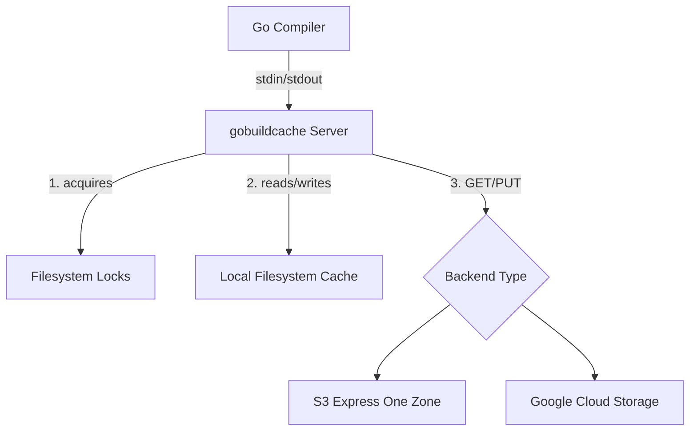
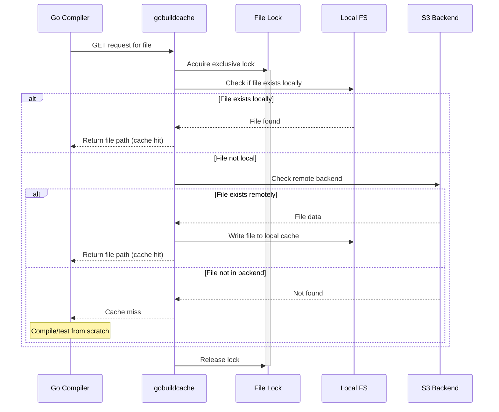
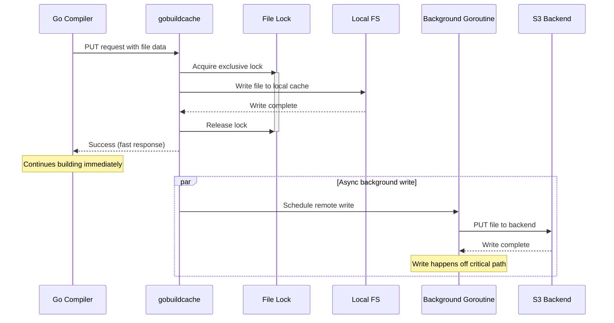

- [Overview](#overview)
- [Quick Start](#quick-start)
  - [Installation](#installation)
  - [Usage](#usage)
  - [Github Actions Example](#github-actions-example)
  - [S3 Lifecycle Policy](#s3-lifecycle-policy)
- [Preventing Cache Bloat](#preventing-cache-bloat)
- [Configuration](#configuration)
- [How it Works](#how-it-works)
  - [Architecture Overview](#architecture-overview)
  - [Processing GET commands](#processing-get-commands)
  - [Processing PUT commands](#processing-put-commands)
  - [Locking](#locking)
- [Frequently Asked Questions](#frequently-asked-questions)
  - [Why should I use gobuildcache?](#why-should-i-use-gobuildcache)
  - [Can I use regular S3?](#can-i-use-regular-s3)
  - [Do I have to use gobuildcache with self-hosted runners in AWS and S3OZ?](#do-i-have-to-use-gobuildcache-with-self-hosted-runners-in-aws-and-s3oz)

# Overview
`gobuildcache` implements the [gocacheprog](https://pkg.go.dev/cmd/go/internal/cacheprog) interface defined by the Go compiler over a variety of storage backends, the most important of which is S3 Express One Zone (henceforth referred to as S3OZ). Its primary purpose is to accelerate CI (both compilation and tests) for large Go repositories. You can think of it as a self-hostable and OSS version of [Depot's remote cache feature](https://depot.dev/blog/go-remote-cache).

Effectively, `gobuildcache` leverages S3OZ as a distributed build cache for concurrent `go build` or `go test` processes regardless of whether they're running on a single machine or distributed across a fleet of CI VMs. This dramatically improves CI performance for large Go repositories because each CI process will behave as if running with an almost completely pre-populated build cache, even if the CI process was started on a completely ephemeral VM that has never compiled code or executed tests for the repository before.

`gobuildcache` is highly sensitive to the latency of the remote storage backend, so it works best when running on self-hosted runners in AWS targeting an S3 Express One Zone bucket in the same region (and ideally same availability zone) as the self-hosted runners. That said, it doesn't have to be used that way. For example, if you're using Github's hosted runners or self-hosted runners outside of AWS, you can use a different storage solution like Tigris or Google Cloud Storage (GCS). For GCP users, enabling GCS Anywhere Cache can provide performance similar to S3OZ for read-heavy workloads. See `examples/github_actions_tigris.yml` for an example of using `gobuildcache` with Tigris.

# Quick Start

## Installation

```bash
go install github.com/richardartoul/gobuildcache@latest
```

## Usage

```bash
export GOCACHEPROG=gobuildcache
go build ./...
go test ./...
```

By default, `gobuildcache` uses an on-disk cache stored in the OS default temporary directory. This is useful for testing and experimentation with `gobuildcache`, but provides no benefits over the Go compiler's built-in cache, which also stores cached data locally on disk.

For "production" use-cases in CI, you'll want to configure `gobuildcache` to use S3 Express One Zone, Google Cloud Storage, or a similarly low latency distributed backend.

### Using S3

```bash
export GOBUILDCACHE_BACKEND_TYPE=s3
export GOBUILDCACHE_S3_BUCKET=$BUCKET_NAME
```

You'll also have to provide AWS credentials. `gobuildcache` embeds the AWS V2 S3 SDK so any method of providing credentials to that library will work, but the simplest is to use environment variables as demonstrated below.

```bash
export GOCACHEPROG=gobuildcache
export GOBUILDCACHE_BACKEND_TYPE=s3
export GOBUILDCACHE_S3_BUCKET=$BUCKET_NAME
export GOBUILDCACHE_AWS_REGION=$BUCKET_REGION
export GOBUILDCACHE_AWS_ACCESS_KEY_ID=$AWS_ACCESS_KEY
export GOBUILDCACHE_AWS_SECRET_ACCESS_KEY=$AWS_SECRET_ACCESS_KEY
export GOBUILDCACHE_AWS_SESSION_TOKEN=$AWS_SESSION_TOKEN  # optional, for temporary credentials
go build ./...
go test ./...
```

> **Note**: All configuration environment variables support both `GOBUILDCACHE_<KEY>` and `<KEY>` forms (e.g., both `GOBUILDCACHE_S3_BUCKET` and `S3_BUCKET` work). The prefixed version takes precedence if both are set. The prefixed form is strongly recommended for AWS variables (`GOBUILDCACHE_AWS_REGION`, `GOBUILDCACHE_AWS_ACCESS_KEY_ID`, `GOBUILDCACHE_AWS_SECRET_ACCESS_KEY`, `GOBUILDCACHE_AWS_SESSION_TOKEN`) — by using the prefixed form instead of the standard `AWS_*` variables, you avoid those values being inherited by other processes in the same environment (e.g., test binaries spawned by `go test`). If the prefixed variable is set to an empty string, it falls through to the unprefixed version (or default).

### Using Google Cloud Storage (GCS)

```bash
export GOBUILDCACHE_BACKEND_TYPE=gcs
export GOBUILDCACHE_GCS_BUCKET=$BUCKET_NAME
```

GCS authentication uses Application Default Credentials. You can provide credentials in one of the following ways:

1. **Service Account JSON file** (recommended for CI):
```bash
export GOOGLE_APPLICATION_CREDENTIALS=/path/to/service-account-key.json
export GOCACHEPROG=gobuildcache
export GOBUILDCACHE_BACKEND_TYPE=gcs
export GOBUILDCACHE_GCS_BUCKET=$BUCKET_NAME
go build ./...
go test ./...
```

2. **Metadata service** (when running on GCP):
```bash
# No credentials file needed - uses metadata service automatically
export GOCACHEPROG=gobuildcache
export GOBUILDCACHE_BACKEND_TYPE=gcs
export GOBUILDCACHE_GCS_BUCKET=$BUCKET_NAME
go build ./...
go test ./...
```

3. **gcloud CLI credentials** (for local development):
```bash
gcloud auth application-default login
export GOCACHEPROG=gobuildcache
export GOBUILDCACHE_BACKEND_TYPE=gcs
export GOBUILDCACHE_GCS_BUCKET=$BUCKET_NAME
go build ./...
go test ./...
```

#### GCS Anywhere Cache (Recommended for Performance)

For improved performance, especially in read-heavy workloads, consider enabling [GCS Anywhere Cache](https://cloud.google.com/storage/docs/anywhere-cache). Anywhere Cache provides an SSD-backed zonal read cache that can significantly reduce latency for frequently accessed cache objects.

**Benefits:**
- **Lower read latency**: Cached reads from the same zone can achieve single-digit millisecond latency, comparable to S3OZ for repeated access
- **Reduced costs**: Lower data transfer costs, especially for multi-region buckets, and reduced retrieval fees
- **Better performance**: Especially beneficial when multiple CI jobs access the same cached artifacts
- **Automatic scaling**: Cache capacity and bandwidth scale automatically based on usage

**Requirements:**
- Bucket must be in a [supported region/zone](https://cloud.google.com/storage/docs/anywhere-cache#availability)
- CI runners should be in the same zone as the cache for optimal performance
- Anywhere Cache is most effective for read-heavy workloads with high cache hit ratios

**Setup:**
1. Verify your bucket region/zone supports Anywhere Cache
2. Enable Anywhere Cache on your GCS bucket
3. Configure the cache in the same zone as your CI runners for best performance
4. Set admission policy to "First miss" for faster warm-up (caches on first access)
5. Configure TTL based on your needs (1 hour to 7 days, default 24 hours)

```bash
# Enable Anywhere Cache using gcloud CLI
# Replace ZONE_NAME with the zone where your CI runners are located
gcloud storage buckets update gs://YOUR_BUCKET_NAME \
    --enable-anywhere-cache \
    --anywhere-cache-zone=ZONE_NAME \
    --anywhere-cache-admission-policy=FIRST_MISS \
    --anywhere-cache-ttl=7d
```

**Note:** 
- Anywhere Cache only accelerates reads. Writes still go directly to the bucket, but since `gobuildcache` performs writes asynchronously, this typically doesn't impact build performance.
- First-time access to an object will still hit the bucket (cache miss), but subsequent reads will be served from the cache.
- For best results, ensure your CI runners and cache are in the same zone.

For more details, including availability by region, see the [GCS Anywhere Cache documentation](https://cloud.google.com/storage/docs/anywhere-cache).

#### AWS Credentials Permissions

Your credentials must have the following permissions:

```json
{
  "Version": "2012-10-17",
  "Statement": [
    {
      "Effect": "Allow",
      "Action": [
        "s3:GetObject",
        "s3:PutObject",
        "s3:DeleteObject",
        "s3:ListBucket",
        "s3:HeadBucket",
        "s3:HeadObject"
      ],
      "Resource": [
        "arn:aws:s3:::$BUCKET_NAME",
        "arn:aws:s3:::$BUCKET_NAME/*"
      ]
    },
    {
      "Effect": "Allow",
      "Action": [
        "s3express:CreateSession"
      ],
      "Resource": [
        "arn:aws:s3express:$REGION:$ACCOUNT_ID:bucket/$BUCKET_NAME"
      ]
    }
  ]
}
```

#### GCS Credentials Permissions

Your GCS service account must have the following IAM roles or permissions:

- `storage.objects.create` - to upload cache objects
- `storage.objects.get` - to download cache objects
- `storage.objects.delete` - to delete cache objects (for clearing)
- `storage.objects.list` - to list objects (for clearing)

The simplest way is to grant the `Storage Object Admin` role to your service account:

```bash
gcloud projects add-iam-policy-binding PROJECT_ID \
    --member="serviceAccount:SERVICE_ACCOUNT_EMAIL" \
    --role="roles/storage.objectAdmin"
```

Or for more granular control, create a custom role with only the required permissions.

## Github Actions Example

See the `examples` directory for examples of how to use `gobuildcache` in a Github Actions workflow. 

## Lifecycle Policies

It's recommended to configure a lifecycle policy on your storage bucket to automatically expire old cache entries and control storage costs. Build cache data is typically only useful for a limited time (e.g., a few days to a week), after which it's likely stale.

### S3 Lifecycle Policy

Here's a sample S3 lifecycle policy that expires objects after 7 days and aborts incomplete multipart uploads after 24 hours:

```json
{
  "Rules": [
    {
      "Id": "ExpireOldCacheEntries",
      "Status": "Enabled",
      "Filter": {
        "Prefix": ""
      },
      "Expiration": {
        "Days": 7
      },
      "AbortIncompleteMultipartUpload": {
        "DaysAfterInitiation": 1
      }
    }
  ]
}
```

### GCS Lifecycle Policy

For GCS, you can configure a lifecycle policy using `gsutil` or the GCP Console. Here's an example using `gsutil` that expires objects after 7 days:

```bash
gsutil lifecycle set - <<EOF
{
  "lifecycle": {
    "rule": [
      {
        "action": {"type": "Delete"},
        "condition": {"age": 7}
      }
    ]
  }
}
EOF
gsutil lifecycle set - gs://YOUR_BUCKET_NAME
```

Or using the GCP Console, navigate to your bucket → Lifecycle → Add a rule → Set condition to "Age" of 7 days → Action to "Delete".

# Preventing Cache Bloat

`gobuildcache` performs zero automatic GC or trimming of the local filesystem cache or the remote cache backend. Therefore, it is recommended that you run your CI on VMs with ephemeral storage and do not persist storage between CI runs. In addition, you should ensure that your remote cache backend has a lifecycle policy configured like the one described in the previous section.

That said, you can use the `gobuildcache` binary to clear the local filesystem cache and remote cache backends by running the following commands:

```bash
gobuildcache clear-local
```

```bash
gobuildcache clear-remote
```

The clear commands take the same flags / environment variables as the regular `gobuildcache` tool, so for example you can provide the `cache-dir` flag or `CACHE_DIR` environment variable to the `clear-local` command and the `s3-bucket` flag or `S3_BUCKET` environment variable (or `gcs-bucket`/`GCS_BUCKET` for GCS) to the `clear-remote` command.

# Configuration

`gobuildcache` ships with reasonable defaults, but this section provides a complete overview of flags / environment variables that can be used to override behavior.

All environment variables support both `GOBUILDCACHE_<KEY>` and `<KEY>` forms (e.g., `GOBUILDCACHE_S3_BUCKET` or `S3_BUCKET`). The prefixed version takes precedence if both are set.

| Flag | Environment Variable | Default | Description |
|------|----------------------|---------|-------------|
| `-backend` | `GOBUILDCACHE_BACKEND_TYPE` | `disk` | Backend type: `disk`, `s3`, or `gcs` |
| `-lock-type` | `GOBUILDCACHE_LOCK_TYPE` | `fslock` | Locking: `fslock` or `memory` |
| `-cache-dir` | `GOBUILDCACHE_CACHE_DIR` | `$TMPDIR/gobuildcache/cache` | Local cache directory |
| `-lock-dir` | `GOBUILDCACHE_LOCK_DIR` | `$TMPDIR/gobuildcache/locks` | Filesystem lock directory |
| `-s3-bucket` | `GOBUILDCACHE_S3_BUCKET` | (none) | S3 bucket name (required for S3) |
| `-s3-prefix` | `GOBUILDCACHE_S3_PREFIX` | (empty) | S3 key prefix |
| `-gcs-bucket` | `GOBUILDCACHE_GCS_BUCKET` | (none) | GCS bucket name (required for GCS) |
| `-gcs-prefix` | `GOBUILDCACHE_GCS_PREFIX` | (empty) | GCS object prefix |
| `-debug` | `GOBUILDCACHE_DEBUG` | `false` | Enable debug logging |
| `-stats` | `GOBUILDCACHE_PRINT_STATS` | `false` | Print cache statistics on exit |
| `-read-only` | `GOBUILDCACHE_READ_ONLY` | `false` | Read-only mode: allow cache reads but skip writes |
| (env var only) | `GOBUILDCACHE_AWS_REGION` | (none) | AWS region for S3 backend (falls back to `AWS_REGION`) |
| (env var only) | `GOBUILDCACHE_AWS_ACCESS_KEY_ID` | (none) | AWS access key for S3 backend (falls back to `AWS_ACCESS_KEY_ID`) |
| (env var only) | `GOBUILDCACHE_AWS_SECRET_ACCESS_KEY` | (none) | AWS secret key for S3 backend (falls back to `AWS_SECRET_ACCESS_KEY`) |
| (env var only) | `GOBUILDCACHE_AWS_SESSION_TOKEN` | (none) | AWS session token for temporary credentials (falls back to `AWS_SESSION_TOKEN`) |


# How it Works

`gobuildcache` runs a server that processes commands from the Go compiler over stdin and writes results over stdout. Ultimately, `GET` and `PUT` commands are processed by remote backends like S3OZ, but first they're proxied through the local filesystem.

## Architecture Overview



## Processing `GET` commands

When `gobuildcache` receives a `GET` command, it checks if the requested file is already stored locally on disk. If the file already exists locally, it returns the path of the cached file so that the Go compiler can use it immediately. If the file is not present locally, it consults the configured "backend" to see if the file is cached remotely. If it is, it loads the file from the remote backend, writes it to the local filesystem, and then returns the path of the cached file. If the file is not present in the remote backend, it returns a cache miss and the Go toolchain will compile the file or execute the test.



## Processing `PUT` commands

When `gobuildcache` receives a `PUT` command, it writes the provided file to its local on-disk cache. Separately, it schedules a background goroutine to write the file to the remote backend. It writes to the remote backend outside of the critical path to avoid the latency of S3OZ writes from blocking the Go toolchain from making further progress in the meantime.



## Locking

`gobuildcache` uses exclusive filesystem locks to fence `GET` and `PUT` operations for the same file such that only one operation can run concurrently for any given file (operations across different files can proceed concurrently). This ensures that the filesystem does not get corrupted by trying to write the same file path concurrently if concurrent PUTs are received for the same file. It also prevents `GET` operations from seeing torn/partial writes from failed or in-flight `PUT` operations. Finally, it deduplicates `GET` operations against the remote backend, which saves resources, money, and bandwidth.

# Frequently Asked Questions

## Why should I use gobuildcache?

The alternative to using `gobuildcache` is to manually manage the go build cache yourself by restoring a shared go build cache at the beginning of the CI run, and then saving the freshly updated go build cache at the end of the CI run so that it can be restored by subsequent CI jobs. However, the approach taken by `gobuildcache` is much more efficient, resulting in dramatically lower CI times (and bills) with significantly less "CI engineering" required.

First, the local on-disk cache of the CI VM doesn't have to be pre-populated at once. `gobuildcache` populates it by loading the cache on the fly as the Go compiler compiles code and runs tests. This makes it so you don't have to waste several precious minutes of CI time waiting for gigabytes of data to be downloaded and decompressed while CI cores sit idle. This is why S3OZ's low latency is crucial to `gobuildcache`'s design.

Second, `gobuildcache` is rarely stale. A big problem with the common caching pattern described above is that if the PR under test differs "significantly" from the main branch (say, because a package that many other packages depend on has been modified) then the Go toolchain will be required to compile almost every file from scratch, as well as run almost every test in the repo.

Contrast that with the `gobuildcache` approach where the first commit that is pushed will incur the penalty described above, but all subsequent commits will experience extremely high cache hit ratios. One way to think about this benefit is that with the common approach, only one "branch" of the repository can be cached at any given time (usually the `main` branch), and as a result all PRs experience CI delays that are roughly proportional to how much they "differ" from `main`. With the `gobuildcache` approach, the cache stored in S3OZ can store a hot cache for all of the different branches and PRs in the repository at the same time. This makes cache misses significantly less likely, and reduces average CI times dramatically.

Third, the `gobuildcache` approach completely obviates the need to determine how frequently to "rebuild" the shared cache tarball. This is important because rebuilding the shared cache is expensive as it usually has to be built from a CI process running with no pre-built cache to avoid infinite cache bloat, but if it's run too infrequently then CI for PRs will be slow (because they "differ" too much from the stale cached tarball).

Fourth, `gobuildcache` makes parallelizing CI using commonly supported "matrix" strategies much easier and efficient. For example, consider the common pattern where unit tests are split across 4 concurrent CI jobs using Github actions matrix functionality. In this approach, each CI job runs ~ 1/4th of the unit tests in the repository and each CI job determines which tests its responsible for running by hashing the unit tests name and then moduloing it by the index assigned to the CI job by Github actions matrix functionality.

This works great for parallelizing test execution across multiple VMs, but it presents a huge problem for build caching. The Go build cache doesn't just cache package compilation, it also caches test execution. This is a hugely important optimization for CI because it means that if you can populate the CI job's build cache efficiently, PRs that modify packages that not many other packages depend on will only have to run a small fraction of the total tests in the repository. 

However, generating this cache is difficult because each CI job is only executing a fraction of the test suite, so the build cache generated by CI job 1 will result in 0 cache hits for job 2 and vice versa. As a result, each CI job matrix unit must restore and save a build cache that is unique to its specific matrix index. This is doable, but it's annoying and requires solving a bunch of other incidental engineering challenges like making sure the cache is only ever saved from CI jobs running on the main branch, and using consistent hashing instead of modulo hashing to assign tests to CI job matrix units (because otherwise adding a single test will completely shuffle the assignment of tests to CI jobs and the cache hit ratio will be terrible).

All of these problems just disappear when using `gobuildcache` because the CI jobs behave much more like stateless, ephemeral compute while still benefiting from extremely high cache hit ratios due to the shared / distributed cache backend.

## Can I use regular S3?

Yes, but the latency of regular S3 is 10-20x higher than S3OZ, which undermines the approach taken by `gobuildcache`. For some workloads you'll still see an improvement over not using `gobuildcache` at all, but for others CI performance will actually get worse. I highly recommend using S3 Express One Zone instead.

## Do I have to use `gobuildcache` with self-hosted runners in AWS and S3OZ?

No, you can use `gobuildcache` any way you want as long as the `gobuildcache` binary can reach the remote storage backend. For example, you could run it on your laptop and use regular S3, R2, Tigris, or Google Cloud Storage as the remote object storage solution. However, `gobuildcache` works best when the latency of remote backend operations (`GET` and `PUT`) is low, so for best performance we recommend:

- **AWS**: Self-hosted CI running in AWS targeting a S3OZ bucket in the same region (and ideally same availability zone) as your CI runners
- **GCP**: Self-hosted CI running in GCP targeting a GCS Regional Standard bucket in the same region as your CI runners. For even better performance, consider enabling [GCS Anywhere Cache](https://cloud.google.com/storage/docs/anywhere-cache) to get zonal read caching.

## Can I use Google Cloud Storage instead of S3?

Yes! `gobuildcache` supports Google Cloud Storage (GCS) as a backend. GCS is a good alternative to S3, especially if you're already using GCP infrastructure. 

**Performance Considerations:**

- **Standard GCS**: While GCS doesn't have an exact equivalent to S3 Express One Zone's single-AZ storage, using GCS Regional Standard buckets in the same region as your compute provides good performance.

- **GCS with Anywhere Cache** (Recommended): For read-heavy workloads like build caches, enabling [GCS Anywhere Cache](https://cloud.google.com/storage/docs/anywhere-cache) can significantly improve performance:
  - **Read latency**: Cached reads from the same zone can achieve single-digit millisecond latency, comparable to S3OZ for repeated access
  - **Cost savings**: Reduced data transfer costs and lower read operation costs
  - **Best for**: Workloads where the same cache objects are accessed multiple times (common in CI where multiple jobs may access the same artifacts)
  
  Anywhere Cache is particularly effective when:
  - Your CI runners are in the same zone as the cache
  - You have high cache hit ratios (same objects accessed repeatedly)
  - Your bucket is in a [supported region/zone](https://cloud.google.com/storage/docs/anywhere-cache#availability)

- **Write latency**: GCS write latency may be higher than S3OZ, but since `gobuildcache` performs writes asynchronously, this typically doesn't impact build performance significantly.

**Recommendation**: If you're using GCP and want performance closer to S3OZ, use GCS Regional Standard buckets with Anywhere Cache enabled in the same zone as your CI runners. This provides excellent read performance while maintaining better durability than single-AZ storage.